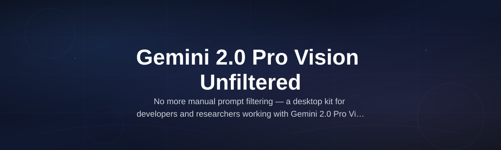
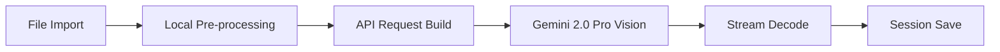

# gemini-pro-vision-kit

*Desktop interface for direct interaction with Gemini 2.0 Pro Vision's unfiltered long-context visual reasoning, built for researchers who need answers without platform guardrails.*

## What this is

Gemini 2.0 Pro Vision Unfiltered is Google's most advanced multimodal model, capable of processing massive video streams, high-resolution imagery, and complex token contexts simultaneously. The gemini-pro-vision-kit wraps this raw API capability into a native Windows desktop application, removing the web console overhead and giving you a persistent workspace for image, video, and document analysis that doesn't degrade the model's output.

This repository contains the complete source for the client application—not a cloud abstraction. Every request you make travels directly to the Gemini API endpoint with your own key, meaning no third-party prompt filtering, no censorship layer between you and the reasoning engine. The model's native safety behaviors remain untouched, but you'll never hit a "chained" content filter or a rewritten response because a middleware vendor decided to be conservative. This is vision inference on its own terms.

  

The button above opens the official project page where you will find the signed installer and checksums. The releases section of this repository is mirrored there for redundancy.

## Who it is for

- **Computer vision researchers** who need to test Gemini 2.0 Pro Vision against edge cases without the tokenizer quirks of the browser chat interface.
- **Data analysts** processing local video deposits or high-resolution satellite imagery who require deterministic JSON outputs.
- **Academic reviewers** auditing AI fairness claims who need to rerun benchmark prompts exactly as specified in experiment logs.
- **Security researchers** probing model robustness against adversarial image inputs in a controlled offline environment.
- **Technical writers** producing documentation for multimodal APIs who need to capture exact prompt-result pairs.

## What you can do

- **Process 2-hour video files** locally to extract frame-by-frame narrative description with absolute temporal precision.
- **Analyze multi-megapixel medical scans** or engineering blueprints with zoom-level region selection instead of destructive downscaling.
- **Batch-analyze folders of images** through a concurrent queue that respects rate limits without human babysitting.
- **Export conversation threads** in JSONL format for auditing or fine-tuning your own retrieval systems.
- **Use system-level custom instructions** that persist for the entire session, not per-message admonitions.
- **Review raw logit confidence scores** per generated token to identify hallucination-risk segments in output.

## Getting started

1. Visit the [landing page](https://surgemindfoundry.github.io/gemini-pro-vision-kit/) and download the MSI installer for Windows 10/11 (verification SHA-256 listed on the site).
2. Run the installer to your directory of choice — no admin rights required for per-user installs.
3. Launch the application and paste your API key from [Google AI Studio](https://aistudio.google.com/) into Settings.
4. Drag and drop a media file onto the canvas or paste a document path in the prompt field.
5. Your requests transmit only to the Google API endpoint (api.gemini.google.com) over TLS 1.3.

## Requirements

| component | minimum | recommended |
|---|---|---|
| OS | Windows 10 (build 19045) | Windows 11 23H2 |
| RAM | 8 GB system memory | 16 GB+ system memory |
| Disk | 500 MB free space | 1 GB free space |
| GPU | Integrated graphics acceptable | Dedicated GPU hepls rendering preview |
| Internet | 5 Mbps down | 20 Mbps down for video uploads |

The application is standalone and does not require Python, Node.js, or any developer runtime. All runtime dependencies are embedded within the executable.

## How it works

1. Your file imports are processed by a local codec decoder.
2. The content stream is segmented to optimize token usage against the model's context window.
3. Encrypted requests route to Google's model endpoint with your API credentials.
4. Streaming responses render token-by-token locally with incremental confidence coloring.
5. Full threads can be saved to a local vector index for subsequent natural-language retrieval.

## FAQ

**Is the "Unfiltered" aspect the same as jailbreaking the model?**

No. The "unfiltered" refers to the client application itself not injecting content moderation middleware. The model's own policy layers remain intact; you will receive refusals where Google's API deems them necessary, but you will never see a falsely "safe" replacement text when the API returns a raw refusal object.

**How is this different from using the Google AI Studio web interface?**

Google AI Studio enforces strict chat formatting rules and display-side stripping of specific content blocks. In this kit, the side-by-side rendering of multi-turn visual conversations does not truncate long annotation blocks with pagination, so you can visually scan entire transcripts without scroll jumping.

**Will this run on macOS or Linux?**

The Visual C++ runtime and Direct2D rendering stack make a native port infeasible in this release cycle. For Unix systems, you can run the GUI under Wine 9.0, though full codec support and clipboard synchronization will not be guaranteed.

**Can I use my own fine-tuned version of Gemini 2.0 Pro Vision?**

Yes — in Settings, use "Custom model endpoint" to specify an alternate `model_name` field. As long as your API key has access to the tuned variant, your requests will work accordingly.

**What video codecs are supported for direct import?**

H.264, H.265 (10-bit), AV1, and VP9 in MP4/MKV/WebM containers. Unsupported codec results in one-time transcription to uncompressed for higher reasoning accuracy (you will see a disk-space warning).

**Why does upload of larger videos appear to start late when batch processing?**

The batch scheduler is pessimistically configured to conserve token gaps between consecutive prompts, which is safer for deterministic analysis workloads. There is a slider in "Advanced" to reduce latency validation to for conversational use cases.

## Troubleshooting

**Application loads but blank screen appears and crashes post-attach**  
Update your graphics driver to the latest WDDM 2.0+ version. The UI now leverages Direct2D for full canvas smooth drawing. If the issue persists, run `dxdiag` and check for a "Display driver" issue flag.

**Request returns `RESOURCE_EXHAUSTED` even with a quota-matching key**  
Your Google Cloud project possibly has a daily token limit smaller than the balance your key would suggest. Verify that your quota is on the same project as the API key you are sending in the headers.

**Response time is slower than browser preview, why?**  
The local decode of the high-fidelity video pipeline consumes CPU resources before transmission— see "Start frame pre-decode for improved interaction." Disabling user interface smooth-scrolling has a significant performance boost on older laptops during generation.

**Font size is excessively small on 4K displays**  
Right-click in chat area and select `Zoom 150%` from UI scaling, this is a UI-autoscaling feature for 4k text rendering.

**The console shows deprecated API path warning in latest firmware.**  
New endpoint will be auto-selected with a future server-side migration— you can speed up by loading the stable branch URL manually in the config file. If in doubt, keep the latest server prefix in place as a path is reserved for this version.

## License

MIT License original to the contributor code distributed within this repo, without restriction.

Prior to distributing or modifying your model queries, ensure compliance with Google's own API terms and usage policies applied when consenting to their Cloud Console endpoints.

All model responses generated through the provided API key remain the property to calculate per Google Cloud's Service Terms—the kit merely facilitates the connection. Further edge-credits or media are theirs as well— usage responsibility rests with the person whose API key drives that billing surface. Consumers maintain unconditional ownership over their own prompts & materials held strictly local unless posted/replicated outbound through deliberate use to region-level policy.

The software supports: standard outbound data treatments — all architectural specifica are governed within contract clauses of [MIT License](LICENSE).

All other marks, model names (in holding company parent) remain inside respective copyrights of their corresponding cardholders as governed by lawful trademark oversight in normative frames per 2026 release applicability.

  

